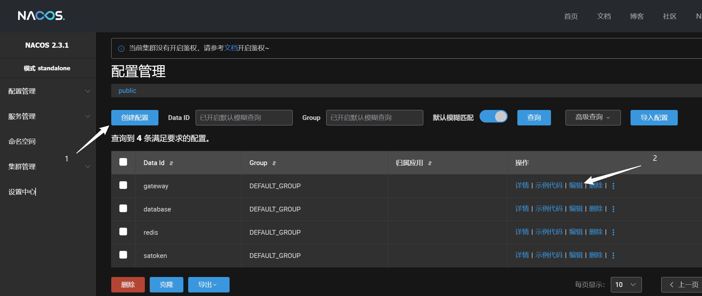

安装依赖
```cmd
pip install uvicorn, fastapi, pydantic, requests, pyyaml, python-multipart, blobfile
```

### Nacos配置中心
python 3.8

登录http://60.205.236.106:8848/nacos/

1. 创建配置
2. 编辑配置

### EdithCloudNacos
python与nacos的sdk，目前已经实现
- 获取config（仅支持yaml）
- 监听config变动并实时缓存（需要开启监听器）
```python
from EdithCloudNacos import NacosClient

instance = NacosClient()
# 获取config原文
print(instance.config_caches[0].config)
# 获取并自动解析config
config = instance.get_config(0)
# 通过dataid获取ImportConfig
config = instance.get_config_from_data_id('redis')
# 添加自定义监听器
instance.config_caches[0].add_feedback('1', lambda e: print(f'\n{e[0].dataId}被修改: \n', instance.config_caches[0].config))
# 激活监听器
instance.active_config_listener()
# 关闭监听器线程
instance.listener.terminate()
```
### RedisConfig
处理redis连接，实现SaToken鉴权

### SaTokenAuthorize
实现SaToken鉴权的FastApi中间件（**未测试**）

### Application
服务器业务类事例